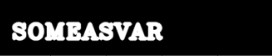
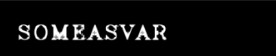

# Implementation-of-Erosion-and-Dilation
# AIM:
To implement Erosion and Dilation using Python and OpenCV.
# SOFTWARE REQUIRED:
1. Anaconda - Python 3.7
2. OpenCV
# ALGORITHM:
## Step 1:
Import the necessary packages.
## Step 2:
Create the Text using cv2.putText.
## Step 3:
Create the structuring element.
## Step 4:
Erode the image.
## Step 5:
Dilate the image.

 
# PROGRAM:
```
PROGRAM DEVELOPED BY: R.SOMEASVAR
REGISTER NUMBER: 212221230103
```
## Import the necessary packages:
```
import numpy as np
import cv2
import matplotlib.pyplot as plt
```
## Load the image:
```
img1=np.zeros((100,500),dtype='uint8')
font=cv2.FONT_HERSHEY_COMPLEX_SMALL
```
## Create the Text using cv2.putText:
```
cv2.putText(img1,' SOMEASVAR ',(5,70),font,2,(255),5,cv2.LINE_AA)
plt.imshow(img1,cmap='gray')
```
## Create the structuring element:
```
kernel1=cv2.getStructuringElement(cv2.MORPH_CROSS,(7,7))
```
## Erode the image:
```
img_erode=cv2.erode(img1,kernel1)
plt.imshow(img_erode,cmap='gray')
```
## Dilate the image:
```
img_dilate=cv2.dilate(img1,kernel1)
plt.imshow(img_dilate,cmap='gray')
```
# OUTPUT:

## Display the input Image:


## Display the Eroded Image:



## Display the Dilated Image:


# RESULT:
Thus the generated text image is eroded and dilated using python and OpenCV.